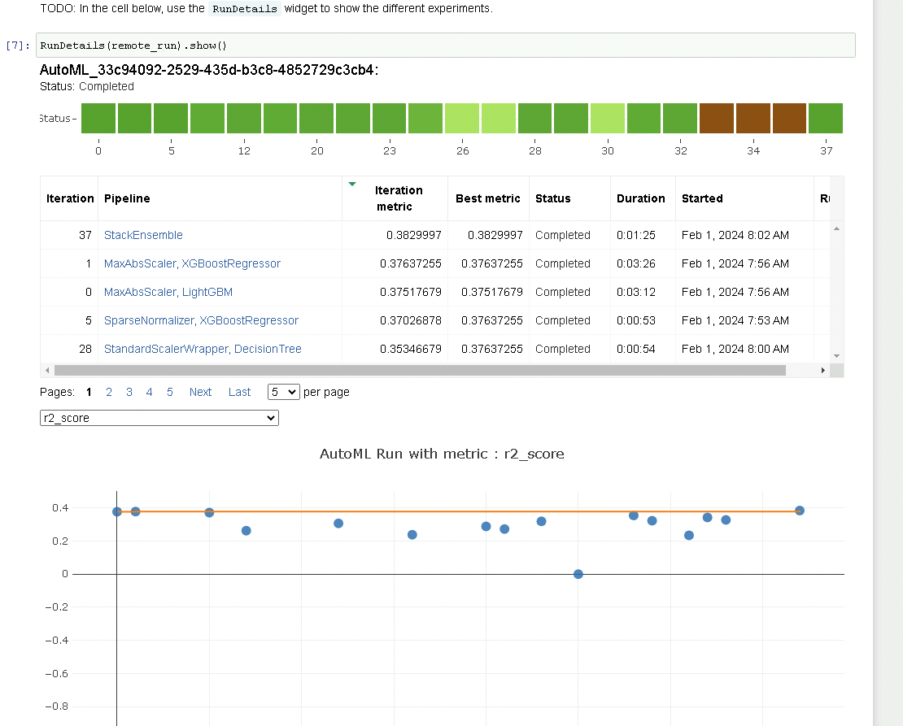

*NOTE:* This file is a template that you can use to create the README for your project. The *TODO* comments below will highlight the information you should be sure to include.

# Predicing Salaries of Jobs in Data Science

For my Capstone Project, I chose a dataset from Kaggle containing salaries of Jobs in Data Science. My goal is to predict the salary based on the additional information in the dataset.

## Dataset

### Overview
I am using the "Jobs and Salaries in Data Science" dataset from kaggle (https://www.kaggle.com/datasets/hummaamqaasim/jobs-in-data?resource=download). It contains job descriptions (e.g., Data Engineer, Data Scientist) and salaries (both in original currency and USD), experience level, type of employment (full time vs part-time), and work setting (in-person/hybrid). For the capstone project I want to predict the salary in USD using a regression model. It's important to delete the "salary" column (in original currency) beforehand, as it is almost the same as the target column and should not be an input of the model.

### Task
I am predicting the salary with two approaches, namely (1) running a hyperdrive experiment and hyperparameter tuning and (2) running an AutoML experiment. For both approaches, I am working with a regression model, since the salary is not a categorical target value, but a continuous one.

### Access
I am registering the data set in the AzureML workspace. In the AutoML experiment, I am directly accessing the registered dataset through its key.
In the hyperdrive run, I am reading the dataset from the csv (available in the project github) in the train.py file. I am dropping the salary and currency columns and preprocess the data with one-hot encoding for categorical variables and integer encoding for ordinal variables.

## Automated ML
For the automl settings, I am choosing a timeout of 30 minutes, maximum concurrent iterations of 4 and 5 cross validations. As primary metric, I am using the r2 score, with is a standard metric for regression tasks and makes my automl experiment comparable to the hyperdrive experiment, in which I use the SGDRegressor with the same metric.

In the configurations, I am setting the task to regression, choosing the registered dataset and naming "salary_in_usd" as target column.

### Results
In the RunDetails screenshot, the top performing mdoels can be seen. 

 
Below is a screenshot of the best model. It is a StackEnsemble with an R2 Score of 0.38, MAPE of 29.67% and MAE of 30432.

## Hyperparameter Tuning

For the hyperdrive experiment, I chose an SGDRegressor. Since my target variable is the salary, a logistic regression is not optimally suited. A linear regression is not sophisticated enough either, and it also does not have hyperparameters that can be tuned according to the sklearn documentation. Therefore, I am using the SGDRegressor which is a good choice for regression tasks. I am tuning the parameters alpha, which determines the strength of regularization, and max_iter, which is the maximum number of passes over the training data (aka epochs). Both are essential hyperparameters for the SGDRegressor. I am choosing ranges that are suggested in the documentation of the SGDRegressor.

I am choosing the Bandit Policy as it is one of the suitable temrination policies for this model. The primary metric of the SGD is the coefficient of determination, rsquared, which needs to be maximized.

### Results
Below is a screenshot of the best model with the corresponsindg hyperparameters alpha and max iterations as well as the resulting R squared score of 0.025. I think the model might have been improved with additional hyperparameter tuning, for example exploring a larger range of the already introduced parameters, but also experimenting with other parameters, such as the penalty or the loss used.

In the RunDetails screenshot, the top performing mdoels can be seen. 

## Model Deployment

Here you can see the succesful deployment of the best performing AutoML model, which scored better than the hyperdrive model and was therefore chosen for deployment (see 2nd screenshot for "operation suceeded"):

In the last screenshot, you can see the successfull request response of the API call:

## Screen Recording
*TODO* Provide a link to a screen recording of the project in action. Remember that the screencast should demonstrate:
- A working model
- Demo of the deployed  model
- Demo of a sample request sent to the endpoint and its response

Link to the screencast: https://youtu.be/S-atsjTsyWk